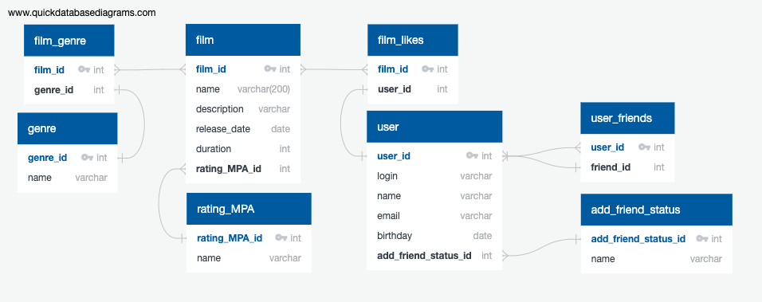

### [Ссылка на схему БД](https://app.quickdatabasediagrams.com/#/d/P3E3M5)

### [Ссылка на файл для создания таблиц schema.sql](src/main/resources/schema.sql)

### **Примеры SQL запросов для основных операций приложения в классе FilmController:**
### [Ссылка на класс FilmController](src/main/java/ru/yandex/practicum/filmorate/controller/FilmController.java)

### [Ссылка на запрос для @GetMapping("/films")](src/main/resources/sql%20script/@GetMapping(":films").sql)
### [Ссылка на запрос для @GetMapping("/films/{filmId}")](src/main/resources/sql%20script/@GetMapping(":films:{filmId}").sql)
### [Ссылка на запрос для @GetMapping("/films/popular?count={countFilms}")](src/main/resources/sql%20script/@GetMapping(":films:popular|count={countFilms}").sql)
### [Ссылка на запрос для @PutMapping("/films")](src/main/resources/sql%20script/@PutMapping(":films").sql)
### [Ссылка на запрос для @PutMapping("/films/{filmId}/like/{userId}")](src/main/resources/sql%20script/@PutMapping(":films:{filmId}:like:{userId}").sql)
### [Ссылка на запрос для @DeleteMapping("/films/{filmId}/like/{userId}")](src/main/resources/sql%20script/@DeleteMapping(":films:{filmId}:like:{userId}").sql)
### **Примеры SQL запросов для основных операций приложения в классе UserController:**
### [ссылка на класс UserController](src/main/java/ru/yandex/practicum/filmorate/controller/UserController.java)
### [Ссылка на запрос для @GetMapping("/users")](src/main/resources/sql%20script/@PostMapping(":users").sql)
### [Ссылка на запрос для @GetMapping("/users/{userId}")](src/main/resources/sql%20script/@GetMapping(":users:{userId}").sql)
### [Ссылка на запрос для @GetMapping("/users/{userId}/friends")](src/main/resources/sql%20script/@GetMapping(":users:{userId}:friends").sql)
### [Ссылка на запрос для @GetMapping("/users/{userId}/friends/common/{otherUserId}")](src/main/resources/sql%20script/@GetMapping(":users:{userId}:friends:common:{otherUserId}").sql)
### [Ссылка на запрос для @PostMapping("/users")](src/main/resources/sql%20script/@PostMapping(":users").sql)
### [Ссылка на запрос для @PutMapping("/users/{userId}/friends/{friendId}")](src/main/resources/sql%20script/@PutMapping(":users:{userId}:friends:{friendId}").sql)