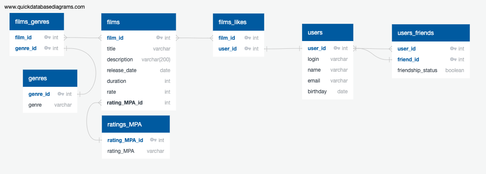

##[Ссылка на схему БД](https://app.quickdatabasediagrams.com/#/d/P3E3M5)

### Примеры SQL запросов для основных http запросов в классе FilmController:
### [ссылка на FilmController](src/main/java/ru/yandex/practicum/filmorate/controller/FilmController.java)
1. ### *+@GetMapping("/films")**
**SELECT** *
**FROM** film **AS** f  
**LEFT INNER JOIN** film_likes **AS** fl **ON** f.film_id=fl.film_id  
**LEFT INNER JOIN** film_genre **AS** fg **ON** f.film_id=fg.film_id  
**LEFT INNER JOIN** genre **AS** g **ON** fg.genre_id=g.genre_id  
**LEFT INNER JOIN** ratingMPA **AS** r **ON** f.rating_MPA_id=r.rating_MPA_id;

2. ### **+@GetMapping("/films/{filmId}")**
**SELECT** *
**FROM** film **AS** f  
**LEFT INNER JOIN** film_likes **AS** fl **ON** f.film_id=fl.film_id  
**LEFT INNER JOIN** film_genre **AS** fg **ON** f.genre_id=fg.genre_id  
**LEFT INNER JOIN** genre **AS** g **ON** fg.genre_id=g.genre_id  
**LEFT INNER JOIN** ratingMPA **AS** r **ON** f.rating_MPA_id=r.rating_MPA_id  
**WHERE** film_id = filmId;
3. ### **-@GetMapping("/films/popular?count={countFilms}")**
**SELECT** *
**FROM** film **AS** f  
**LEFT INNER JOIN** film_likes **AS** fl **ON** f.film_id=fl.film_id  
**LEFT INNER JOIN** film_genre **AS** fg **ON** f.genre_id=fg.genre_id  
**LEFT INNER JOIN** genre **AS** g **ON** fg.genre_id=g.genre_id    
**LEFT INNER JOIN** ratingMPA **AS** r **ON** f.ratingMPA_id=r.ratingMPA_id  
**WHERE**
GROUP BY f.name
ORDER BY COUNT(u.login)
**LIMIT** countFilms
### Примеры SQL запросов для основных http запросов в классе UserController:
### [ссылка на UserController](src/main/java/ru/yandex/practicum/filmorate/controller/UserController.java)
1. @GetMapping("/users")
SELECT \*  
FROM user AS u  
LEFT INNER JOIN user AS u2 ON u2.repost_to=u.user.id  
LEFT INNER JOIN add_friend_status AS afs ON u.add_friend_status_id=afs.add_friend_status_id
2. @GetMapping("/users/{userId}")
3. @GetMapping("/users/{userId}/friends")
4. @GetMapping("/users/{userId}/friends/common/{otherUserId}")